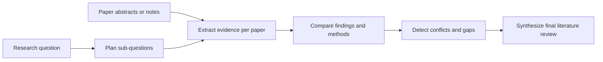

# Literature Review Agent

A Gemini-powered research workflow that transforms a research question plus a set of paper abstracts into a structured literature review with intermediate evidence, comparison results, and review trace.

## Overview

This project focuses on the part of literature review work that benefits from staged reasoning rather than one-shot text generation. Instead of asking a model for a single summary, the agent:

1. decomposes a research question into sub-questions
2. extracts structured evidence from each paper
3. compares patterns across papers
4. identifies conflicts and research gaps
5. synthesizes a final review

The result is a more inspectable workflow with explicit intermediate state.

## Features

- Multi-step agent pipeline for literature review synthesis
- Structured JSON outputs for planning, extraction, and comparison stages
- Streamlit interface for interactive runs
- Review trace for debugging and auditability
- Lightweight Python codebase with a `src/` layout

## Workflow



## Repository Structure

```text
literature_review_agent/
|-- app.py
|-- pyproject.toml
|-- requirements.txt
|-- README.md
|-- docs/
|   `-- ARCHITECTURE.md
|-- examples/
|   `-- sample_papers.txt
`-- src/
    `-- literature_review_agent/
        |-- __init__.py
        |-- agent.py
        |-- gemini_client.py
        |-- prompts.py
        |-- schemas.py
        `-- utils.py
```

## Quickstart

### 1. Install dependencies

```bash
python -m pip install -r requirements.txt
```

### 2. Configure your Gemini API key

PowerShell:

```powershell
$env:GEMINI_API_KEY="your_key_here"
```

Git Bash:

```bash
export GEMINI_API_KEY="your_key_here"
```

### 3. Run the app

```bash
streamlit run app.py
```

## Example Input

Use a focused research question and paste multiple paper abstracts separated by a line containing only `---`.

Example question:

```text
How are transformers being used for time-series forecasting, and what limitations appear most often across recent papers?
```

Example paper input is available in [examples/sample_papers.txt](examples/sample_papers.txt).

## Core Components

- [app.py](app.py): Streamlit interface and run orchestration
- [src/literature_review_agent/agent.py](src/literature_review_agent/agent.py): multi-stage pipeline controller
- [src/literature_review_agent/gemini_client.py](src/literature_review_agent/gemini_client.py): Gemini wrapper for text and JSON generation
- [src/literature_review_agent/prompts.py](src/literature_review_agent/prompts.py): task-specific prompts for each stage
- [src/literature_review_agent/schemas.py](src/literature_review_agent/schemas.py): result models
- [src/literature_review_agent/utils.py](src/literature_review_agent/utils.py): paper parsing helpers

## Design Notes

- The agent keeps intermediate state in memory for the duration of a run.
- JSON cleaning is handled defensively because model responses can be wrapped in markdown fences.
- The current version expects user-provided paper text rather than performing external retrieval.

More detail is available in [docs/ARCHITECTURE.md](docs/ARCHITECTURE.md).

## Limitations

- Retrieval is manual in the current version; papers are not fetched automatically.
- The pipeline relies on abstracts or excerpts rather than full-paper parsing.
- Output quality depends on the quality and coverage of the supplied paper text.

## Roadmap

- Add automated paper retrieval from reputable academic APIs
- Add PDF ingestion and citation-aware output
- Cache intermediate artifacts to reduce repeated token usage
- Add evaluation checks for unsupported claims or weak evidence
