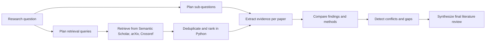

# Literature Review Agent

A Gemini-powered research workflow that plans retrieval queries, searches multiple scholarly sources, deduplicates and ranks papers in Python, and synthesizes a structured literature review from the top results.

## Overview

This project focuses on the part of literature review work that benefits from staged reasoning rather than one-shot text generation. Instead of asking a model for a single summary, the agent:

1. plans source-specific search queries from the research question
2. retrieves candidates from Semantic Scholar, arXiv, and Crossref
3. deduplicates overlapping papers across sources
4. ranks candidates with source-aware scoring in Python and keeps the top set
5. extracts structured evidence from the selected papers
6. compares patterns across papers
7. identifies conflicts and research gaps
8. synthesizes a final review

The result is a more inspectable workflow with explicit intermediate state and visible retrieval provenance.

## Features

- Query planning before retrieval
- Multi-source retrieval with fallback and local caching
- Cross-source deduplication plus source-aware ranking
- Structured JSON outputs for planning, extraction, and comparison stages
- Streamlit interface for interactive runs
- Review trace for debugging and auditability
- Lightweight Python codebase with a `src/` layout

## Workflow



## Repository Structure

```text
literature_review_agent/
|-- app.py
|-- pyproject.toml
|-- requirements.txt
|-- README.md
|-- LICENSE
|-- docs/
|   `-- ARCHITECTURE.md
|-- examples/
|   `-- sample_papers.txt
`-- src/
    `-- literature_review_agent/
        |-- __init__.py
        |-- agent.py
        |-- gemini_client.py
        |-- prompts.py
        |-- query_planner.py
        |-- retriever.py
        |-- schemas.py
        `-- utils.py
```

## Quickstart

### 1. Install dependencies

```bash
python -m pip install -r requirements.txt
```

### 2. Configure your Gemini API key

PowerShell:

```powershell
$env:GEMINI_API_KEY="your_key_here"
$env:SEMANTIC_SCHOLAR_API_KEY="your_optional_key_here"
```

Git Bash:

```bash
export GEMINI_API_KEY="your_key_here"
export SEMANTIC_SCHOLAR_API_KEY="your_optional_key_here"
```

`SEMANTIC_SCHOLAR_API_KEY` is optional, but recommended if you want more reliable retrieval at higher request volumes.

### 3. Run the app

```bash
streamlit run app.py
```

## Example Input

Use a focused research question. The app handles paper discovery automatically.

Example question:

```text
How are transformers being used for time-series forecasting, and what limitations appear most often across recent papers?
```

## UI Output

For each run, the app shows:

- selected papers with source provenance and ranking reasons
- extracted evidence for each selected paper
- the final literature review, including gaps and conflicts
- the full run trace, including retrieval-query planning

## Core Components

- [app.py](app.py): Streamlit interface and run orchestration
- [src/literature_review_agent/agent.py](src/literature_review_agent/agent.py): multi-stage pipeline controller
- [src/literature_review_agent/query_planner.py](src/literature_review_agent/query_planner.py): deterministic search-query planning
- [src/literature_review_agent/retriever.py](src/literature_review_agent/retriever.py): multi-source retrieval, deduplication, caching, and source-aware ranking
- [src/literature_review_agent/gemini_client.py](src/literature_review_agent/gemini_client.py): Gemini wrapper for text and JSON generation
- [src/literature_review_agent/prompts.py](src/literature_review_agent/prompts.py): task-specific prompts for each stage
- [src/literature_review_agent/schemas.py](src/literature_review_agent/schemas.py): result models
- [src/literature_review_agent/utils.py](src/literature_review_agent/utils.py): paper parsing helpers

## Design Notes

- The agent keeps intermediate state in memory for the duration of a run.
- JSON cleaning is handled defensively because model responses can be wrapped in markdown fences.
- Query planning, retrieval, deduplication, and ranking happen in Python before Gemini is called.
- This keeps LLM usage focused on extraction, comparison, and synthesis.
- Retrieval results are cached locally to reduce repeated API calls and make retries cheaper.
- Evidence extraction is batched across the selected papers to reduce LLM request count and fit free-tier usage more reliably.

## Implementation Learnings

- Pushing more work into Python, especially retrieval planning and ranking, makes the system cheaper and more deterministic.
- Multi-source retrieval is useful for resilience, but source-aware ranking is necessary because metadata quality varies a lot across providers.
- Batch extraction is a better fit than one-call-per-paper when working under strict API quotas.
- Source provenance matters in the UI because it helps explain why a paper was selected and how trustworthy the metadata is.

More detail is available in [docs/ARCHITECTURE.md](docs/ARCHITECTURE.md).

## Limitations

- The current version relies on paper metadata and abstracts rather than full-paper parsing.
- Output quality depends on the quality and coverage of the retrieved paper metadata.
- Source API availability and rate limits affect retrieval quality.
- Crossref metadata quality varies by publisher, especially for abstract coverage.
- arXiv is strong for technical preprints, but not every topic is equally represented there.

## Roadmap

- Add PDF ingestion and citation-aware output
- Add stronger venue-aware and domain-aware ranking signals
- Add evaluation checks for unsupported claims or weak evidence
