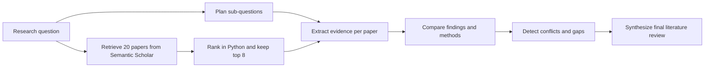

# Literature Review Agent

A Gemini-powered research workflow that retrieves papers from Semantic Scholar, ranks them in Python, and synthesizes a structured literature review from the top results.

## Overview

This project focuses on the part of literature review work that benefits from staged reasoning rather than one-shot text generation. Instead of asking a model for a single summary, the agent:

1. decomposes a research question into sub-questions
2. retrieves up to 20 candidate papers from Semantic Scholar
3. ranks those candidates deterministically in Python and keeps the top 8
4. extracts structured evidence from the selected papers
5. compares patterns across papers
6. identifies conflicts and research gaps
7. synthesizes a final review

The result is a more inspectable workflow with explicit intermediate state.

## Features

- Multi-step agent pipeline for literature review synthesis
- Semantic Scholar retrieval with deterministic ranking reasons
- Structured JSON outputs for planning, extraction, and comparison stages
- Streamlit interface for interactive runs
- Review trace for debugging and auditability
- Lightweight Python codebase with a `src/` layout

## Workflow



## Repository Structure

```text
literature_review_agent/
|-- app.py
|-- pyproject.toml
|-- requirements.txt
|-- README.md
|-- LICENSE
|-- docs/
|   `-- ARCHITECTURE.md
|-- examples/
|   `-- sample_papers.txt
`-- src/
    `-- literature_review_agent/
        |-- __init__.py
        |-- agent.py
        |-- gemini_client.py
        |-- prompts.py
        |-- retriever.py
        |-- schemas.py
        `-- utils.py
```

## Quickstart

### 1. Install dependencies

```bash
python -m pip install -r requirements.txt
```

### 2. Configure your Gemini API key

PowerShell:

```powershell
$env:GEMINI_API_KEY="your_key_here"
$env:SEMANTIC_SCHOLAR_API_KEY="your_optional_key_here"
```

Git Bash:

```bash
export GEMINI_API_KEY="your_key_here"
export SEMANTIC_SCHOLAR_API_KEY="your_optional_key_here"
```

`SEMANTIC_SCHOLAR_API_KEY` is optional, but recommended if you want more reliable retrieval at higher request volumes.

### 3. Run the app

```bash
streamlit run app.py
```

## Example Input

Use a focused research question. The app handles paper discovery automatically.

Example question:

```text
How are transformers being used for time-series forecasting, and what limitations appear most often across recent papers?
```

## UI Output

For each run, the app shows:

- selected papers from Semantic Scholar
- ranking reasons for why those papers were kept
- extracted evidence for each selected paper
- the final literature review, including gaps and conflicts

## Core Components

- [app.py](app.py): Streamlit interface and run orchestration
- [src/literature_review_agent/agent.py](src/literature_review_agent/agent.py): multi-stage pipeline controller
- [src/literature_review_agent/retriever.py](src/literature_review_agent/retriever.py): Semantic Scholar search and deterministic ranking
- [src/literature_review_agent/gemini_client.py](src/literature_review_agent/gemini_client.py): Gemini wrapper for text and JSON generation
- [src/literature_review_agent/prompts.py](src/literature_review_agent/prompts.py): task-specific prompts for each stage
- [src/literature_review_agent/schemas.py](src/literature_review_agent/schemas.py): result models
- [src/literature_review_agent/utils.py](src/literature_review_agent/utils.py): paper parsing helpers

## Design Notes

- The agent keeps intermediate state in memory for the duration of a run.
- JSON cleaning is handled defensively because model responses can be wrapped in markdown fences.
- Paper retrieval and ranking happen in Python before Gemini is called.
- This keeps LLM usage focused on extraction, comparison, and synthesis.

More detail is available in [docs/ARCHITECTURE.md](docs/ARCHITECTURE.md).

## Limitations

- The current version relies on paper metadata and abstracts rather than full-paper parsing.
- Output quality depends on the quality and coverage of the supplied paper text.
- Semantic Scholar API availability and rate limits affect retrieval quality.

## Roadmap

- Add PDF ingestion and citation-aware output
- Cache intermediate artifacts to reduce repeated token usage
- Add evaluation checks for unsupported claims or weak evidence
